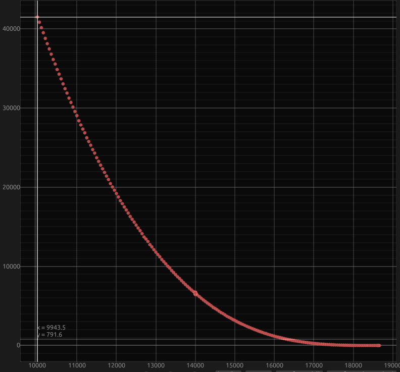

# Получение амплитуды из осциллограммы (18.02.2025)

## processing

### Трапецидальный фильтр

Перед какой-либо обработкой, кадр пилы переводится в дифференциальную форму. Параметры:
- left количество бинов слева трапеции
- center - количество пропущенных бинов из центра
- right - количество бинов справа трапеции

Таким окном проходим по кадру. Итоговое значение в бине вычисляется как разность сумм значений в окне справа и слева от центра деленная (left + right).

[emulate_fir](../src/preprocess.rs#L113)

### Вычисление базовой линии
Базовая линия вычисляется для каждой точки отдельно. Для этого:
1. Создаются 7 гистограмм для каждого канала.
2. Все бины всех кадров в точке добавляются в соответствующую гистограмму.
3. Базовая линия для канала определяется как максимум гистограммы.

    Пример гистограмм для одной точки:
    

4. Полученное значение для каждого канала вычитается из всех бинов кадре.

Полученный кадр во вьювере отображен пунктирной линией того же цвета, что и исходная "пила".

[baseline_from_point](../src/preprocess.rs#L185)

### Получение амплитуды (Trapeziod)
[frame_to_events](../src/process.rs#L275)

- Перед выделением событий из кадра, в нем происходит поиск сброса пилы. 
- В случае обнаружения сброса фрейм помечается как плохой.
- 2-й и 6-й каналы проверяются на переполнение. (для прошлого сеанса)

  Если значение бина в кадре превышает заданный порог (8189 для 2-го и 8081 для 6-го), то все последующие бины до конца кадра или до следующего сброса считаются как переполнение.
  - Если в кадре обнаружено переполнение, фрейм помечается как плохой.

1. Кадр переводится в дифференциальную форму (аналогично как и при вычислении базовой линии) и из него вычитается базовая линия.
2. Проводится один проход итератором по кадру:
   1. Начало кадра определяется как первое превышение порога
   2. Конец кадра определяется как первое значение ниже порога после начала кадра.
   3. Амплитуда события получается суммирований бинов между началом и концом (включая начала, не включая конец).
  
   Если размер события меньше `min length`, то оно пропускается (помогает убрать шумы).

   

   Аппаратный сброс пропускается и в режиме поиска события и в режиме суммирования амплитуды.

   В конце выделения событий производится фильтрация по хорошему/плохому кадру.

   
   - none - ничего не выкидывается
   - bad - выкидываются фреймы, помеченные как плохие (имеют сброс или переполнение)
   - all - выкидываются фреймы, помеченные как хорошие (может быть полезно при исследовании плохих кадров)

#### Определение сброса в кадре
По кадру прогоняется скользящее окно размером `diff window`. Смотрится разница между крайними бинами.
В случае, если разница превышает `diff threshold`, то следующие `reset size` бинов считаются сбросом.

## postprocessing

### cut_bad_blocks
Удаление "провалов" в точке, появившихся в сеансе 2024_11 ([код](../src/preprocess.rs#L68))

| bundle-viewer | trigger-viewer (белыми линиями отмечено то, что вырезает алгоритм) |
|----------|----------|
|   |    |

Алгоритм:
1. Создается гистограмма с диапазоном с шагом 10 нс ([CHECK_BIN_SIZE](../src/preprocess.rs#L19)).
   1. Гистограмма заполняется временными метками фреймов ("триггерами").
2. Полученные бины гистограммы рабиваются на группы по 1с ([CUTOFF_BIN_SIZE](../src/preprocess.rs#L16)).
3. Группа выкидывается целиком, если в ней есть хотя бы один нулевой бин.

Данная процедура проводится только для точек с HV ниже 16 кВ ([CHECK_HV_THRESHOLD](../src/preprocess.rs#L22)).
В точках с более высоким HV критерий отбрасывания не подойдет - там могут быть и "правильные" нулевые бины.

| До | После |
|----------|----------|
|   |    |

### merge splits first
> [!NOTE]  
> Не работает для сеанса 2024_11, т.к. нет 6-го канала.

Сливание "сплитов" в одно событие перед основным мерджингом. ([код](../src/postprocess.rs#L128))

- "Сплит" - это группа событий (обычно пара), пришедших в соседние пиксели примерно в одно время. 
  Должны соответствовать одному электрону. Пример сплита:

  

Алгоритм:

1. Проводится 1 проход по событиям канала 6.
   - проходятся ближайшие события слева и справа (отстоящие менее чем на 200 нс).
   - амплитуда ближайших событий  прибавляется к основному, а сами события помечаются на удаление.
2. После прохода удаляются все помеченные события.

| До | После |
|----------|----------|
|   |    |

### merge-close-events
Сливание соседних событий в кадре. ([код](../src/postprocess.rs#L245))

Алгоритм:
1. Проводится проход по событиям слева направо.
   1. Для каждого события проводится обратный проход от самого правого события к текущему.
      - если событие пришло в пиксель, соседний с основным, то его амлитуда прибавляется к основному, а само событие удаляется.

| До | После |
|----------|----------|
|   |    |
  
### ignore borders
Слияние всех событий, независимо от того, находятся ли они в соседних пикселях или нет.
При включении флага при <a href="#merge-close-events" ref="merge-close-events">merge-close-events</a> не будет проводится проверка соседства пикселей.

| До | После |
|----------|----------|
|   |    |

### ignore channels
Выбранные каналы будут отсеяны из финального результата постобработки (т.е. исключенные каналы все равно будут учавствовать в мержинге).